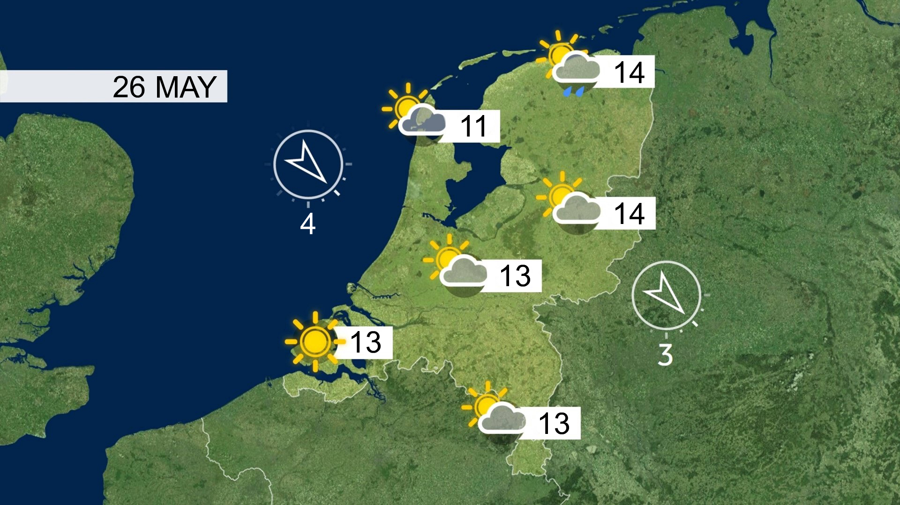

# Microsoft Teams weather background

This is a small tool built with NodeJS to generate a teams background image of the NOS (Dutch Broadcast Foundation) weather map. The temperatures and wind speeds are fetched from the buienradar.nl API.

## Customizing

Currently only the Dutch weather is included, but you can fork the project to fit it for your needs.

- Find an empty weathermap and replace weerkaart_empty.jpg.
- Search for a place on buienradar.nl to see the ID in the address bar.
- Fill in x and y coordinates (trial and error)

If I have time, I will introduce some program parameters or config file, so that you can customize the program without having to mess with the code.

## How to run

1. Install NodeJS
2. Run `npm install` to install dependencies
3. Run `npm start` to start the program. The image is updated every 5 minutes.
